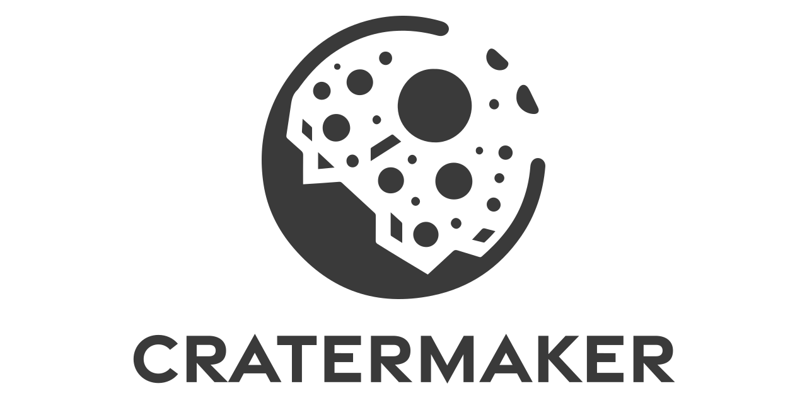

# Welcome to Cratermaker!
Cratermaker Cratermaker was developed at Purdue University as a more user-friendly alternative to the [CTEM](hhttps://github.itap.purdue.edu/MintonGroup/ctem). It is still in development, so not all of the capabilities of CTEM have been implemented, but for those that have been developed, it is a far more powerful piece of software.

This two hour workshop is organized into two parts. In hour 1, I will introduce you to the Cratermaker project through it's Python front-end and its various standalone components.  In hour 2, I will introduce you to the Rust back-end, and show you more advanced concepts, such as writing a custom production function, as well as how to contribute to the Cratermaker project on GitHub.

## Learning Objectives
1. Create a Cratermaker simulation using the Python frontend. 
2. Analyze simulation data output using [ParaView](https://www.paraview.org/), [QGIS](https://qgis.org/), and [UXarray](https://uxarray.readthedocs.io/en/latest/).
3. Customize the Rust backend and compile the project locally.
4. Submit issues, feature requests, documentation and examples, and bugfixes to GitHub. 


## Instructions
Detailed instructions on how to install Cratermaker can be found in the online document pages for Cratermaker [here](https://cratermaker.readthedocs.io/en/latest/user-guide/installation.html). As I will be showcasing some of the Cratermaker functionality inside a Jupyterlab Notebook, I have provide some more specific instructions for setting up the environment here.

For hour 1, we will use the latest pre-compiled public release version of the code, which is available for Linux, MacOS, and Windows as a Python package.  

### Hour 1: Install Jupyter Lab, Cratermaker, ParaView, and QGIS
My preferred method for managing packages is `venv`. If you are more comfortable with some other tool, like `conda`, `poetry`, `uv`, etc, feel free to use that. 

Here I will install a local virtual environment using Python 3.13 with a Jupyter kernel.

```bash
$ python3.13 -m venv venv
$ . venv/bin/activate
$ pip install cratermaker jupyterlab
$ ipython kernel install --user --name=TAP_Cratermaker
```

Then we can fire up Jupyter lab and run simulations.

```bash
$ jupyter lab &
```

Be sure to activate the `TAP_Cratermaker` kernel.

For analyzing output, the two tools I've come to rely on are [ParaView](https://www.paraview.org/) and [QGIS](https://qgis.org/)

### Hour 2: Install a development environment
For this section we will leave Jupyter Lab behind and move to a proper IDE. My preferred IDE is [Visual Studio Code](https://code.visualstudio.com/download), with the following extensions: C/C++ Extension Pack, Python and Python Debugger, rust-analyzer, Remote Development.

Now clone the [Cratermaker GitHub repository](https://github.com/MintonGroup/cratermaker). If you've already cloned it, be sure to pull any updates.

See [here](https://cratermaker.readthedocs.io/en/latest/user-guide/installation.html#installing-cratermaker-from-source) for detailed instructions on installing Cratermaker from source.

